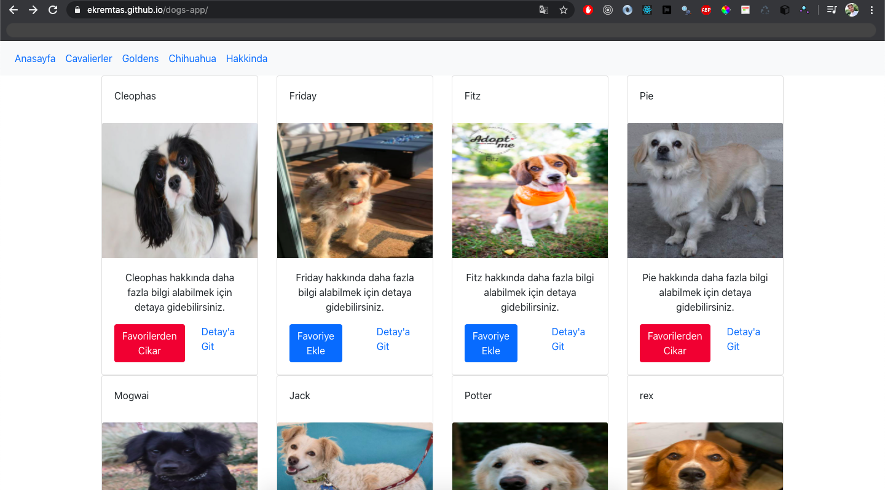
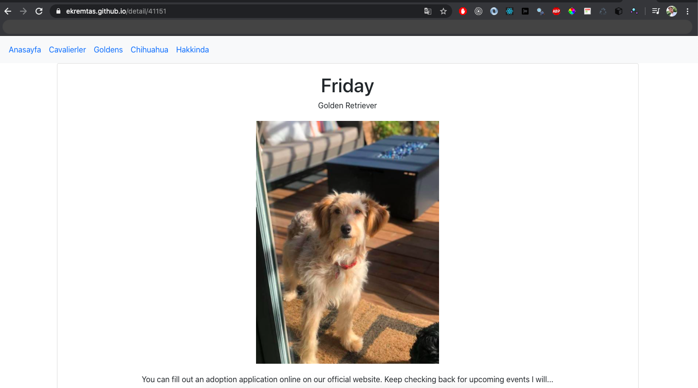

# React & Redux with Dogs Application 
I developed with React & redux; An application that you can access the details by listing the dogs.

## Live Link of the Project

[https://ekremtas.github.io/dogs-app/](https://ekremtas.github.io/dogs-app/)

## Libraries I Use
[React](https://www.npmjs.com/package/react)

[Redux](https://www.npmjs.com/package/redux)

[react-redux](https://www.npmjs.com/package/react-redux)

[react-router-dom](https://www.npmjs.com/package/react-router-dom)

[redux-thunk](https://www.npmjs.com/package/redux-thunk)

[Axios](https://www.npmjs.com/package/axios)

[reactstrap](https://www.npmjs.com/package/reactstrap)

## Run The Project
```
$ yarn install
```
After installing packages with

```
$ yarn start
```
You can run the project with.

# Sample Picture from the Project




#  Projeyi calistirma

`yarn install` komutu ile paketleri yukledikten sonra `yarn start` ile projeyi calistirabilirsiniz.
Bildiginiz gibi bu projede bir backend servisiyle calistik. Projeyi baslatmadan once hompage dosyasindaki API_HOST degiskenini kendi mock api urlinizle degistirmeniz gerek, yoksa proje calismayacaktir. mockapi.io uzerinde bir hesap olusturduktan sonra asagidaki url e tiklarsaniz servis sizin icin clonelanacak.

https://mockapi.io/clone/5ea567662d86f00016b45b7f

Bundan sonra API_HOST degiskenini kendi urliniz ile sonunda / olmadan degistirin.


# Odevler

 - Homepage'de tum kopek isimlerini listelerken, her kopek isminin bir Link haline getirilmesi ve linklere tiklandiginda "/detail/{kopekid}" urline gitmesi, bu urlde de ilgili kopegin image, tur, isim gibi kalan tum detaylarini gosterecegiz.

 - burası halledildi 

 - Bildiginiz uzere bu projede reacstrap kullandik. Siz de odevi yaparken reactstrap componentlerini kullanabilirsiniz stil acisindan daha guzel gozukmesi acisindan.

  - burada reactstrap ile biraz görsellik kattım. 

 - Favoriye ekleme-cikarma islemleri backendden oldugu icin bir bekleme suremiz var. bu bekleme sirasinda butonun disaboled olmasini islem bittikten sonra yeniden aktif olmasini bekliyorum
 
- burada da bir state ekledim loading oldugunda buttonlara spinner getirdim.

## Kaynaklar

- [https://scotch.io/courses/using-react-router-4](https://scotch.io/courses/using-react-router-4)
- [https://www.basefactor.com/react-how-to-display-a-loading-indicator-on-fetch-calls](https://www.basefactor.com/react-how-to-display-a-loading-indicator-on-fetch-calls)
